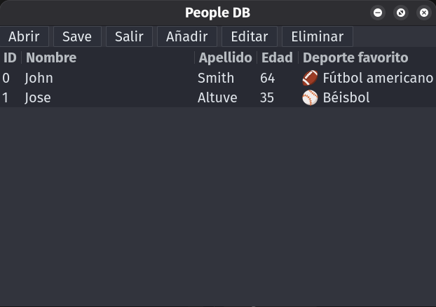
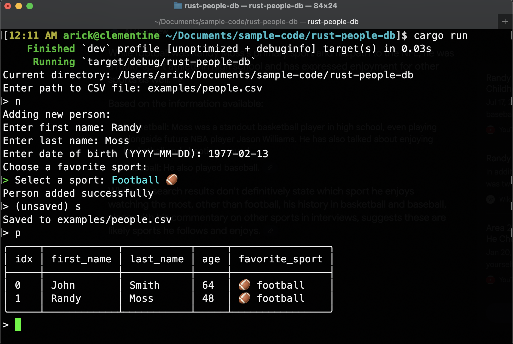

# rust-people-db

## Author

[Eric Popelka](https://github.com/arickp)

A simple Rust application to manage a database of people stored in a CSV file. Available in both CLI and GTK4 GUI interfaces with full internationalization support.

---

**Binaries:**
- `people-db-gtk`: Launches the GTK4 graphical interface
- `people-db`: Launches the interactive command-line interface (CLI)

---

## GTK4 GUI Interface (`people-db-gtk`)

The application includes a modern GTK4 graphical user interface with the following features:

- **Clean, intuitive interface** with menu-based navigation and international translations
- **Table view** displaying people with ID, name, age, and favorite sport columns
- **Add, Edit, Delete operations** with confirmation dialogs
- **File operations** (Open, Save, Exit) with file chooser dialogs
- **Sport selection** with emoji icons and dropdown menus



*The GTK interface shown in Spanish translation*

### Running the GUI

```bash
cargo run --bin people-db-gtk
# or, after building:
./target/debug/people-db-gtk
```

The GUI will prompt you to select a CSV file or create a new one if none exists.

## Interactive CLI Experience (`people-db`)

Simply run the program and follow the interactive prompts to manage your people database:

```bash
cargo run --bin people-db -- examples/people.csv
# or, after building:
./target/debug/people-db examples/people.csv
```

The interactive interface guides you through adding, editing, deleting, and viewing people records with a clean, user-friendly experience.



## Installing

Run `./install.sh` in the project root to copy the executable and its resources to your `~/.local` folder. This has only been tested on Ubuntu Linux running GNOME.

## Features

### Both Interfaces
- **Data validation** with helpful error messages
- **CSV file management** (creates file if it doesn't exist)
- **Structured data fields** including names, birth dates, and favorite sports
- **Sport selection** with emoji icons and predefined options
- **Full internationalization** support (Spanish translation included)

### CLI Interface
- **Interactive prompts** for all operations
- **Edit and delete by index** for easy record management
- **Command-line arguments** for direct operations

### GTK Interface
- **Modern GUI** with menu-based navigation
- **Table view** with sortable columns
- **Confirmation dialogs** for destructive operations
- **File chooser dialogs** for easy file management
- **ID-based operations** for reliable record management

## Getting Started

1. Clone this repository
2. Choose your preferred interface:
   - **GUI**: Run `cargo run --bin people-db-gtk` for the GTK4 interface
   - **CLI**: Run `cargo run --bin people-db -- examples/people.csv` for the interactive CLI
3. Follow the prompts to manage your people database

---

### Command Line Usage (Alternative)

For those who prefer direct command-line usage, you can also use specific commands:

```bash
# Add a new person
cargo run --bin people-db -- examples/people.csv new --first-name John --last-name Smith --date-of-birth 1960-10-10 --favorite-sport football

# Other commands
cargo run --bin people-db -- examples/people.csv print    # Show all people
cargo run --bin people-db -- examples/people.csv edit     # Edit by index
cargo run --bin people-db -- examples/people.csv delete   # Delete by index
cargo run --bin people-db -- --help             # Show help
```
